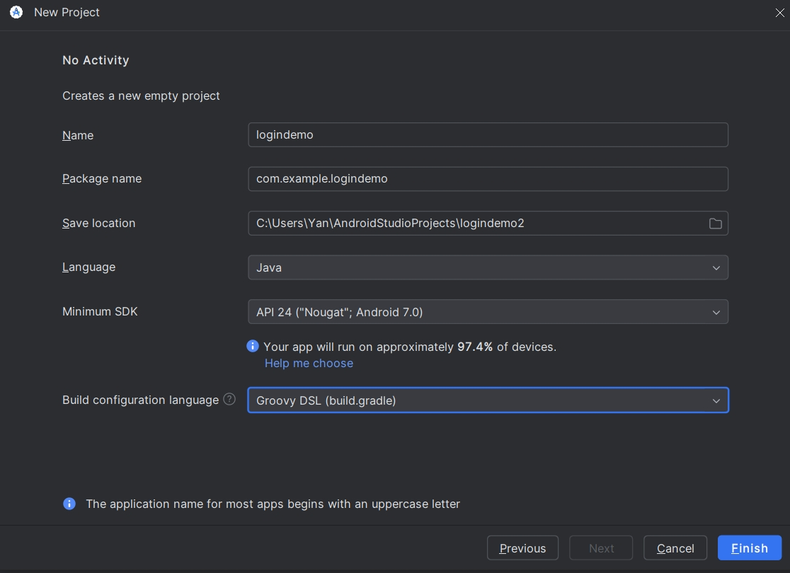
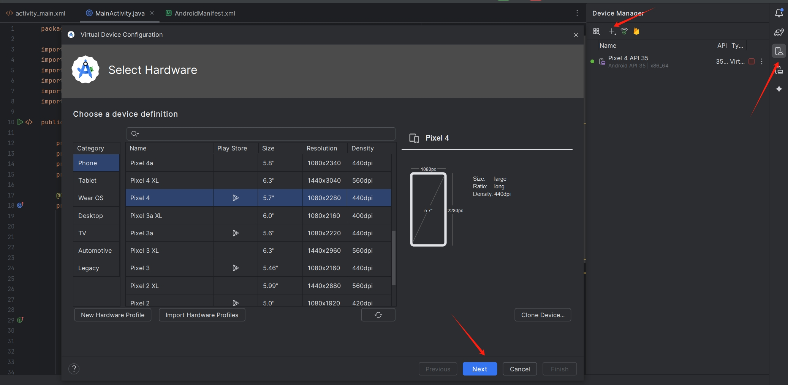
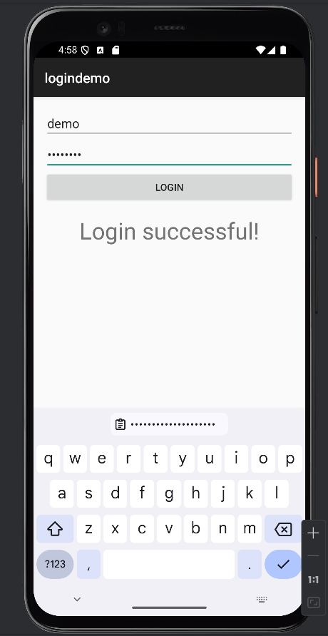
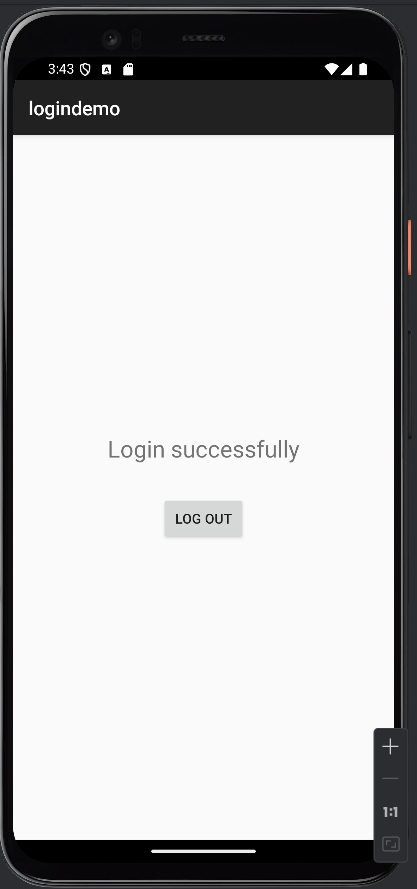

# CSE3310: Creating a Demo Android App with Login Screen
Jingquan Yan
Demo zip (use Android Studio File/New/Import Project): 
https://github.com/jyan97/CSE3310/
09/2024

## 1. Set up Android Studio

1. Download Android Studio from the official website: https://developer.android.com/studio
2. Install Android Studio following the installation wizard.
3. Launch Android Studio after installation.

## 2. Create a new project

1. On the Android Studio welcome screen, click "Create New Project".
2. In the "Select a Project Template" window, choose "Empty Activity" and click "Next".
3. Configure your project with the following details:
   - Name: "cse3310demo"
   - Package name: "com.example.cse3310demo"
   - Save location: Choose your preferred directory
   - Language: Java
   - Minimum SDK: API 24: Android 7.0 (an example)
4. Click "Finish" to create the project.


## 3. Android Studio Virtual Device Management
Before running your app, you need a device to run it on. If you don't have a physical Android device, you can create an Android Virtual Device to simulate one on your computer:

1. Open the AVD Manager:
   - Click on "Tools" in the top menu of Android Studio
   - Select "Device Manager"

2. Create a new virtual device:
   - Click on "Create Virtual Device" button at the bottom left of the window

3. Select a device definition:
   - Choose a device from the list (e.g., Pixel 4)
   - Click "Next"

4. Select a system image:
   - Choose an Android version to run on the virtual device
   - If you haven't downloaded the system image yet, click the "Download" link next to the version you want
   - After downloading (if necessary), select the version and click "Next"

5. Verify the AVD configuration:
   - Give your AVD a name if you want to change it
   - You can adjust advanced settings here if needed, but the defaults are usually fine
   - Click "Finish"

6. Your new AVD will now appear in the Device Manager

To start your AVD:
1. In the Device Manager, find your newly created AVD in the list
2. Click the play button (triangle) in the "Actions" column

The AVD will now boot up. This may take a few moments, especially the first time.


## 4. Design the Login Screen

We'll create a simple layout with input fields for username and password, a login button, and a text view to display the result.

1. In the Project view, navigate to `res/layout/activity_main.xml`.
2. Switch to the "Code" view if you're in the Design view.
3. Replace the existing code with the following XML:

```xml
<?xml version="1.0" encoding="utf-8"?>
<LinearLayout xmlns:android="http://schemas.android.com/apk/res/android"
    android:layout_width="match_parent"
    android:layout_height="match_parent"
    android:orientation="vertical"
    android:padding="16dp">

    <EditText
        android:id="@+id/editTextUsername"
        android:layout_width="match_parent"
        android:layout_height="wrap_content"
        android:hint="Username"
        android:inputType="text" />

    <EditText
        android:id="@+id/editTextPassword"
        android:layout_width="match_parent"
        android:layout_height="wrap_content"
        android:hint="Password"
        android:inputType="textPassword" />

    <Button
        android:id="@+id/buttonLogin"
        android:layout_width="match_parent"
        android:layout_height="wrap_content"
        android:background="#888666"
        android:text="Login" />

    <TextView
        android:id="@+id/textViewResult"
        android:layout_width="match_parent"
        android:layout_height="wrap_content"
        android:layout_marginTop="16dp"
        android:textAlignment="center"
        android:textSize="15pt"/>

</LinearLayout>
```

This XML code creates:
- A `LinearLayout` as the root element, organizing child views vertically.
- Two `EditText` fields for username and password input.
- A `Button` for triggering the login action.
- A `TextView` to display the login result (initially hidden).

## 5. Implement the Login Logic

Now, we'll add the Java code to handle the login logic.

1. In the Project view, create and navigate to `app/src/main/java/com.example.logindemo/MainActivity.java`.
2. Replace the existing code with the following Java code:

```java
package com.example.logindemo;

import android.os.Bundle;
import android.view.View;
import android.widget.Button;
import android.widget.EditText;
import android.widget.TextView;
import androidx.appcompat.app.AppCompatActivity;

public class MainActivity extends AppCompatActivity {

    private EditText editTextUsername;
    private EditText editTextPassword;
    private Button buttonLogin;
    private TextView textViewResult;

    @Override
    protected void onCreate(Bundle savedInstanceState) {
        super.onCreate(savedInstanceState);
        setContentView(R.layout.activity_main);

        editTextUsername = findViewById(R.id.editTextUsername);
        editTextPassword = findViewById(R.id.editTextPassword);
        buttonLogin = findViewById(R.id.buttonLogin);
        textViewResult = findViewById(R.id.textViewResult);

        buttonLogin.setOnClickListener(new View.OnClickListener() {
            @Override
            public void onClick(View v) {
                String username = editTextUsername.getText().toString();
                String password = editTextPassword.getText().toString();

                if (isValidCredentials(username, password)) {
                    textViewResult.setText("Login successful!");
                } else {
                    textViewResult.setText("Invalid username or password");
                }
            }
        });
    }

    private boolean isValidCredentials(String username, String password) {
        return username.equals("demo") && password.equals("password");
    }
}
```

Let's break down this code:

a. Class and field declaration:
```java
public class MainActivity extends AppCompatActivity {
    private EditText editTextUsername;
    private EditText editTextPassword;
    private Button buttonLogin;
    private TextView textViewResult;

```
This declares the `MainActivity` class and the UI elements we'll interact with.

b. `onCreate` method and view initialization:
```java
    @Override
    protected void onCreate(Bundle savedInstanceState) {
        super.onCreate(savedInstanceState);
        setContentView(R.layout.activity_main);

        editTextUsername = findViewById(R.id.editTextUsername);
        editTextPassword = findViewById(R.id.editTextPassword);
        buttonLogin = findViewById(R.id.buttonLogin);
        textViewResult = findViewById(R.id.textViewResult);
```
This sets up the activity's layout and initializes the UI elements by finding them in the layout.

c. Login button click listener:
```java
buttonLogin.setOnClickListener(new View.OnClickListener() {
            @Override
            public void onClick(View v) {
                String username = editTextUsername.getText().toString();
                String password = editTextPassword.getText().toString();

                if (isValidCredentials(username, password)) {
                    textViewResult.setText("Login successful!");
                } else {
                    textViewResult.setText("Invalid username or password");
                }
            }
        }

private boolean isValidCredentials(String username, String password) {
        return username.equals("demo") && password.equals("password");
    }
```
This sets up a click listener for the login button. When clicked, it checks the entered username and password. If they match "demo" and "password", it displays "Login successful!". Otherwise, it shows "Invalid credentials".

The `onClick(View v)` method is called when the user clicks on the view (in our case, the login button), here are the reasons we are using `View` with `onClick` method:
1. What is a View?
   - In Android, a `View` is the basic building block for UI components. 
   - Everything you see on the screen is a View: buttons, text fields, images, etc.

2. What does the `View v` parameter represent?
   - The `v` parameter represents the View that was clicked.
   - In our case, it refers to the login button (`buttonLogin`) that triggered the click event.

## 5. Check the AndroidManifest.xml File

The AndroidManifest.xml file is crucial for any Android application. It contains essential information about your app that the Android system needs to know before it can run any of the app's code. Check it (modify if necessary) to make sure it's correctly set up for the app.

1. In the Project view, navigate to `app/manifests/AndroidManifest.xml`.
2. Open the file and verify that it contains the following content:

```xml
<?xml version="1.0" encoding="utf-8"?>
<manifest xmlns:android="http://schemas.android.com/apk/res/android"
    package="com.example.logindemo">

    <application
        android:allowBackup="true"
        android:icon="@mipmap/ic_launcher"
        android:label="@string/app_name"
        android:roundIcon="@mipmap/ic_launcher_round"
        android:supportsRtl="true"
        android:theme="@style/Theme.AppCompat.Light.DarkActionBar">

        <activity
            android:name="com.example.logindemo.MainActivity"
            android:exported="true">
            <intent-filter>
                <action android:name="android.intent.action.MAIN" />
                <category android:name="android.intent.category.LAUNCHER" />
            </intent-filter>
        </activity>

    </application>

</manifest>
```

The important parts of this file:

- The `package` attribute in the `manifest` tag should match your app's package name.
- The `application` tag contains information about your app, such as its icon and theme.
- Inside the `application` tag, there's an `activity` tag for your `MainActivity`:
  - The `android:name=".MainActivity"` attribute tells Android about your main activity.
  - The `intent-filter` inside the `activity` tag specifies that this is the main entry point of your app and should appear in the launcher.

If you add more activities to your app in the future, you'll need to declare them in this file.

## 6. Run the App

1. Set up and run an Android emulator in Android Studio in Section 3.
2. In Android Studio, click the "Run" button (green play icon) in the toolbar.
3. Select your AVD emulator, then click "OK".
4. Wait for the app to build and install on the device.

## 7. Testing the App

1. When the app launches, you'll see the login screen with username and password fields.
2. Test with correct credentials:
   - Enter "demo" as the username and "password" as the password.
   - Tap the "Login" button.
   - You should see "Hello World!" displayed on the screen.
3. Test with incorrect credentials:
   - Enter any other combination of username and password.
   - Tap the "Login" button.
   - You should see "Invalid credentials" displayed on the screen.

   


   ***
   ***

## 8. Adding a new activity
   What if we want to jump to a new page once logged in? We will need to add a new activity (page) and its corresponding layout. Also modify the logic in the MainActivity and declare the new activity in ``AndroidManifest.xml``.

### 8.1 Modify the Login Page Layout (activity_main.xml)

```xml
<?xml version="1.0" encoding="utf-8"?>
<LinearLayout xmlns:android="http://schemas.android.com/apk/res/android"
    android:layout_width="match_parent"
    android:layout_height="match_parent"
    android:orientation="vertical"
    android:padding="16dp">

    <EditText
        android:id="@+id/editTextUsername"
        android:layout_width="match_parent"
        android:layout_height="wrap_content"
        android:hint="Username" />

    <EditText
        android:id="@+id/editTextPassword"
        android:layout_width="match_parent"
        android:layout_height="wrap_content"
        android:hint="Password"
        android:inputType="textPassword" />

    <Button
        android:id="@+id/buttonLogin"
        android:layout_width="match_parent"
        android:layout_height="wrap_content"
        android:text="Login" />

</LinearLayout>
```
This layout creates a simple login form with username and password fields, and a login button (no more login notification text).

### 8.2 Create a new layout ``activity_success.xml``
```xml
<?xml version="1.0" encoding="utf-8"?>
<LinearLayout xmlns:android="http://schemas.android.com/apk/res/android"
    android:layout_width="match_parent"
    android:layout_height="match_parent"
    android:orientation="vertical"
    android:padding="16dp"
    android:gravity="center">

    <TextView
        android:layout_width="wrap_content"
        android:layout_height="wrap_content"
        android:text="Login successfully"
        android:textSize="24sp"
        android:layout_marginBottom="32dp"/>

    <Button
        android:id="@+id/buttonLogout"
        android:layout_width="wrap_content"
        android:layout_height="wrap_content"
        android:text="Log out" />

</LinearLayout>
```

This layout creates a success page with a "Login successfully" message and a logout button.

### 8.3 Modify the Login Logic in ``MainActivity.java``

```java
package com.example.logindemo;

import android.content.Intent;
import android.os.Bundle;
import android.view.View;
import android.widget.Button;
import android.widget.EditText;
import android.widget.Toast;
import androidx.appcompat.app.AppCompatActivity;

public class MainActivity extends AppCompatActivity {

    private EditText editTextUsername, editTextPassword;
    private Button buttonLogin;

    @Override
    protected void onCreate(Bundle savedInstanceState) {
        super.onCreate(savedInstanceState);
        setContentView(R.layout.activity_main);
        editTextUsername = findViewById(R.id.editTextUsername);
        editTextPassword = findViewById(R.id.editTextPassword);
        buttonLogin = findViewById(R.id.buttonLogin);

        buttonLogin.setOnClickListener(new View.OnClickListener() {
            @Override
            public void onClick(View v) {
                String username = editTextUsername.getText().toString(); // Get string from the box
                String password = editTextPassword.getText().toString();

                // The credential is hard-coded here, we can also query from database
                if (username.equals("demo") && password.equals("password")) {
                    // Successful login
                    Intent intent = new Intent(MainActivity.this, SuccessActivity.class);
                    startActivity(intent);
                } else {
                    // Failed login
                    Toast.makeText(MainActivity.this, "Invalid username or password", Toast.LENGTH_SHORT).show();
                }
            }
        });
    }
}
```

This activity handles the login logic:
- It sets up the UI elements from the layout.
- When the login button is clicked, it checks the entered credentials.
- If login is successful, it starts the SuccessActivity and optionally closes the MainActivity.
- If login fails, it displays a toast message.

### 8.4 Create a new activity ``SuccessActivity.java`` after logging in

```java
package com.example.logindemo;

import android.content.Intent;
import android.os.Bundle;
import android.view.View;
import android.widget.Button;
import androidx.appcompat.app.AppCompatActivity;

public class SuccessActivity extends AppCompatActivity {

    private Button buttonLogout;

    @Override
    protected void onCreate(Bundle savedInstanceState) {
        super.onCreate(savedInstanceState);
        setContentView(R.layout.activity_success);

        buttonLogout = findViewById(R.id.buttonLogout);
        buttonLogout.setOnClickListener(new View.OnClickListener() {
            @Override
            public void onClick(View v) {
                // Navigate back to MainActivity (login page)
                Intent intent = new Intent(SuccessActivity.this, MainActivity.class);
                startActivity(intent);
                finish(); // Close this activity, otherwise one can get back by swiping even after logging out
            }
        });
    }
}
```

This activity handles the success page:
- It sets up the UI elements from the success layout.
- When the logout button is clicked, it starts a new instance of MainActivity and closes the SuccessActivity.

### 8.5 Update ``AndroidManifest.xml`` and declare the new activity ``SuccessActivity``
```xml
<?xml version="1.0" encoding="utf-8"?>
<manifest xmlns:android="http://schemas.android.com/apk/res/android"
    package="com.example.logindemo">

    <application
        android:allowBackup="true"
        android:icon="@mipmap/ic_launcher"
        android:label="@string/app_name"
        android:roundIcon="@mipmap/ic_launcher_round"
        android:supportsRtl="true"
        android:theme="@style/Theme.AppCompat.Light.DarkActionBar">
        
        <activity
            android:name=".MainActivity"
            android:exported="true">
            <intent-filter>
                <action android:name="android.intent.action.MAIN" />
                <category android:name="android.intent.category.LAUNCHER" />
            </intent-filter>
        </activity>
    
        <activity android:name=".SuccessActivity" />
    </application>
</manifest>
```

The AndroidManifest.xml file declares both activities:
- MainActivity is set as the launcher activity (the entry point of the app).
- SuccessActivity is also declared, allowing it to be started from MainActivity.

## 9. Result


